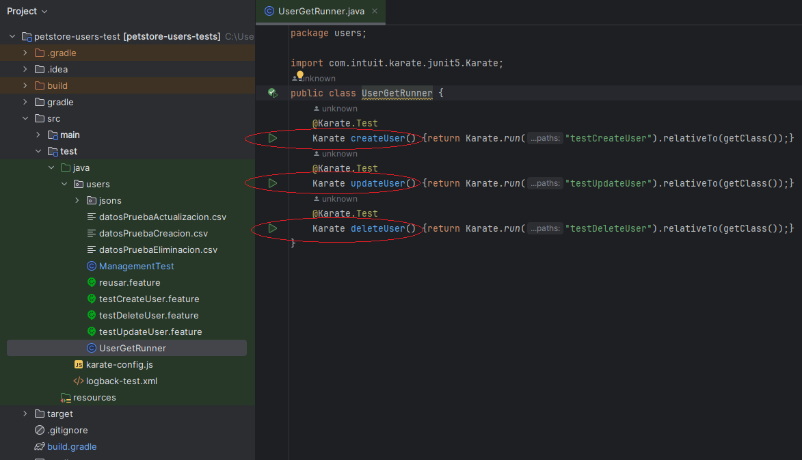

# Challenge Ejercicio de Automatización Prueba de API petstore con KARATE

## Requisitos Previos

Para poder ejecutar el proyecto se debe instalar previamente las siguientes herramientas:
- JDK 17 – Java Development Kit
- Gradle v7.6.1
- IntelliJ IDEA (versión usada para desarrollar el proyecto: 2023.3.2)

## Instrucciones para ejecutar las pruebas
- Clonar el repositorio github desde: https://github.com/chris-barrera-ec/challenge-EjercicioKarate-petshop.git
- Abrir la carpeta del proyecto con IntelliJ IDEA
- Una vez cargadas las dependencias
- Para ejecutar las pruebas dirigirse a la clase test/java/users/UserGetRunner.java y ejecutar los siguientes métodos según el caso:

  - Para probar el escenario que crea el usuario y luego lo busca, ejecutar el método ***createUser()***
  - Para probar el escenario que crea el usuario, actualiza su nombre y correo, y luego lo busca para comprobar los cambios, ejecutar el método ***updateUser()***
  - Para probar el escenario que crea el usuario y luego lo elimina, ejecutar el método ***deleteUser()***
  
  - 
  
  Cada uno de los 3 escenarios tiene su propio archivo csv de donde carga datos para realizar la prueba
  
  Los escenarios que crean y actualizan un usuario, al final del mismo lo borran para que esté no esté creado en la próxima ejecución de los escenarios de pruebas
  

